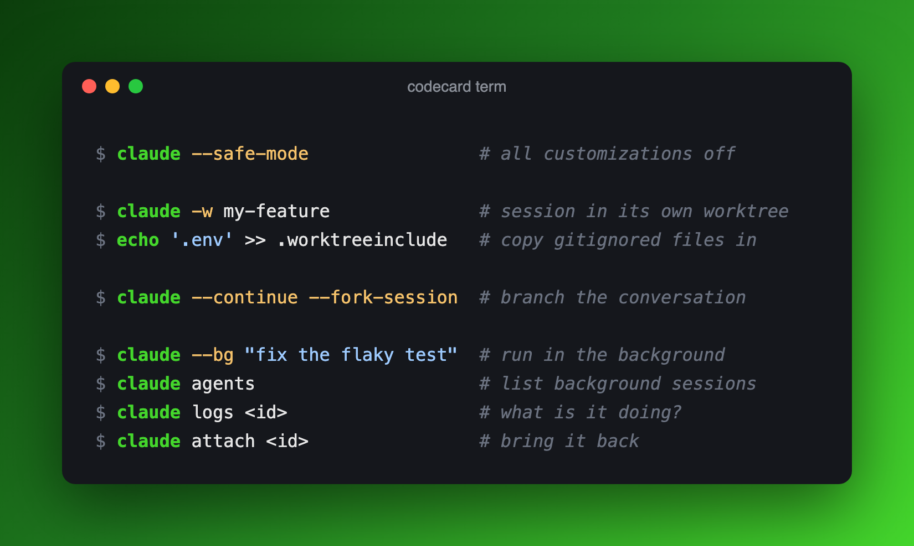
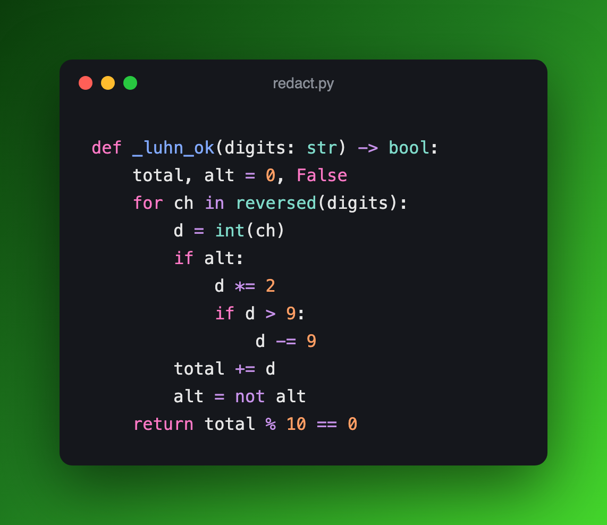
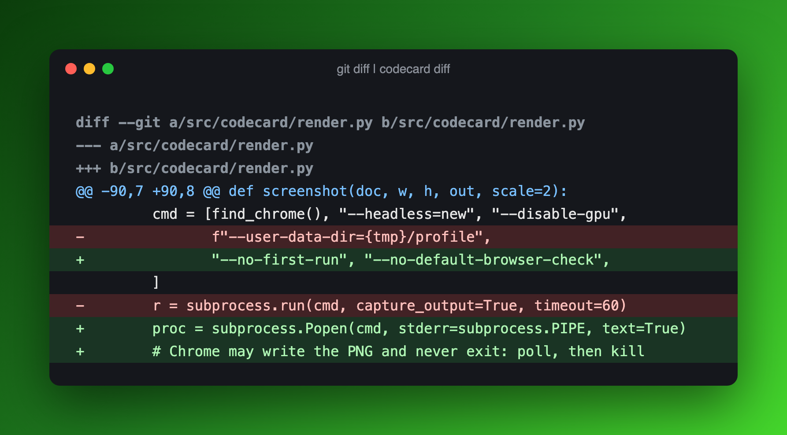
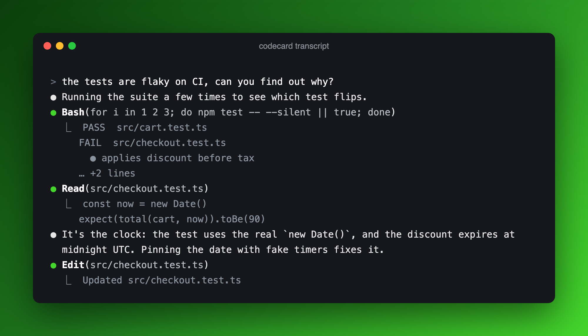
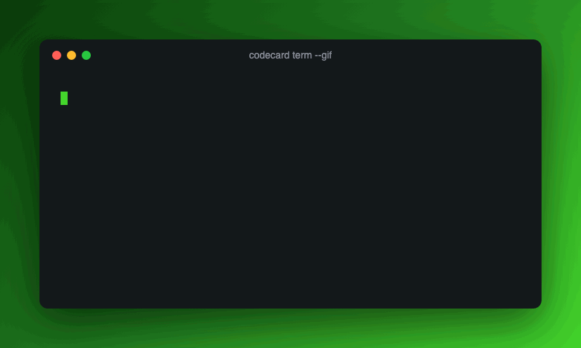

# codecard

**Carbon-style images of code, terminal sessions, diffs and Claude Code transcripts, rendered on your machine and built for agents as well as humans.**



[Carbon](https://carbon.now.sh) and [ray.so](https://ray.so) are great web UIs for people. But an agent can't click through a web UI, and hosted APIs upload your snippet to someone else's server. codecard is a CLI, an MCP server and a Claude skill that all render **locally** with headless Chrome. Your code and session logs never leave the laptop, and secrets are masked by default.

| | |
|---|---|
|  |  |
| `codecard code redact.py` | `git diff \| codecard diff` |

**Agent transcripts.** Turn the last turn of a Claude Code session into one image, drawn in Claude Code's own style (this one is rendered from [`docs/examples/demo-session.jsonl`](docs/examples/demo-session.jsonl)):



**Animated.** Add `--gif` and the lines appear one at a time:



---

## Install

Needs **Python 3.10+** and **Chrome, Chromium, Edge or Brave** (set `CODECARD_CHROME=/path/to/binary` if it isn't found automatically).

```bash
# CLI only
uv tool install git+https://github.com/PuvaanRaaj/codecard

# CLI + MCP server
uv tool install "codecard[mcp] @ git+https://github.com/PuvaanRaaj/codecard"
```

`pipx install "codecard[mcp] @ git+https://github.com/PuvaanRaaj/codecard"` works too.

## Use it from the command line

```bash
codecard code src/app.py -o app.png                  # syntax-highlighted source (language from the filename)
codecard term session.txt -o cmds.png                 # $ commands, output, # comments
codecard term session.txt -o cmds.gif --gif           # the same, animated
git diff HEAD~1 | codecard diff -o change.png         # +/- coloured diff
codecard transcript -n 1 -o turn.png                  # last turn of the newest Claude Code session in this directory
```

Every kind reads a file or stdin and prints the path it wrote.

| Option | Meaning |
|---|---|
| `-o, --out` | Output file, `.png` or `.gif` (default `codecard-<kind>.png`) |
| `-t, --title` | Window title (default: the filename, or the kind) |
| `--bg` | `razer` (green, default), `ocean`, `sunset`, `grape`, `none` (transparent), or any CSS colour/gradient |
| `--cols N` | Wrap width in characters (default: fit the content, 40–100) |
| `--gif` | Animated line-by-line reveal |
| `--scale N` | Pixel density (default 2 for PNG, 1 for GIF) |
| `--no-redact` | Turn off secret masking (see [Safety](#safety)) |
| `-l, --lang` | `code` only: force a language, e.g. `-l php` |
| `-n, --turns N` | `transcript` only: how many of the last prompts to include (default 1) |
| `--max-rows N` | `transcript` only: cap on rows; older rows are dropped (default 40) |
| `--result-lines N` | `transcript` only: lines of each tool result to show (default 3) |

**Terminal input format:** lines starting `$ ` or `> ` are commands, `  # ` starts a comment, and everything else is output. A command that runs over several lines ending in `\` keeps its colours on every line.

**Transcripts:** `codecard transcript` with no argument picks the newest session for the current directory. It searches `~/.claude` and any `~/.claude-*` config dirs, and respects `CLAUDE_CONFIG_DIR`. Pass a session id (or its first few characters) or a `.jsonl` path to choose a different one.

## MCP server

Install with the `mcp` extra (above). That gives you a `codecard-mcp` command that speaks MCP over stdio.

**Claude Code**

```bash
claude mcp add -s user codecard -- codecard-mcp
```

Choose where images go with `-e CODECARD_OUT=~/Pictures/codecard` (default: `$TMPDIR/codecard`).

**Claude Desktop / Cursor / any MCP client**

```json
{
  "mcpServers": {
    "codecard": {
      "command": "codecard-mcp",
      "env": { "CODECARD_OUT": "/Users/you/Pictures/codecard" }
    }
  }
}
```

Claude Desktop reads this from `claude_desktop_config.json`, and Cursor from `~/.cursor/mcp.json`. If the client can't find `codecard-mcp` on its `PATH`, use the full path (`which codecard-mcp`).

**Tools**

| Tool | Renders |
|---|---|
| `render_code(code, language?, filename?, title?, out?, gif?, bg?, cols?)` | Source code |
| `render_terminal(text, title?, out?, gif?, bg?, cols?)` | Terminal session |
| `render_diff(diff, title?, out?, gif?, bg?, cols?)` | Unified diff |
| `render_transcript(session?, cwd?, turns?, max_rows?, title?, out?, gif?, bg?)` | Claude Code session turns |

Each tool returns the file path, and for PNGs the image itself, so the model can check its own output. MCP tools **always redact**; agents can't switch it off. `out` must end in `.png` or `.gif`.

## Claude skill

The skill teaches Claude when to reach for codecard ("make an image of this", "carbon this", "gif of this terminal") and how to use it well: short cards, view the result before handing it over, never skip redaction for anything shared. It uses the CLI, so install that first.

```bash
git clone https://github.com/PuvaanRaaj/codecard ~/codecard
mkdir -p ~/.claude/skills
ln -s ~/codecard/skill ~/.claude/skills/codecard     # or: cp -r ~/codecard/skill ~/.claude/skills/codecard
```

To share it with a team through a repo, put it in the project's `.claude/skills/codecard/` instead. The skill and the MCP server work fine together or separately.

## Safety

- **Redaction is on by default**, before anything is drawn. It masks GitLab, GitHub, Anthropic, Slack and AWS tokens, bearer tokens, JWTs, private-key blocks, `*TOKEN*=` / `*PASSWORD*:`-style assignments, and Luhn-valid card numbers (masked to first 6 / last 4). Your home directory is shown as `~`.
- **Transcripts** never include thinking blocks, subagent sidechains, meta lines or injected `<system-reminder>` text. They **do** include your prompts and tool output, so look at the image before you share it.
- Redaction matches common formats. It won't catch every secret, and it can't know that a hostname or customer name is internal. Treat it as a seatbelt, not a guarantee.
- Nothing is uploaded. Chrome runs headless against a temporary local HTML file.

## How it works

Input → rows of styled tokens (`lexers.py`, `transcript.py`) → wrapped to `--cols` → an HTML card whose height is calculated rather than measured (`render.py`) → **one** headless-Chrome screenshot. GIFs are built from that single screenshot with Pillow by painting over the rows not yet shown, so an animation still costs only one Chrome launch.

## Development

```bash
git clone https://github.com/PuvaanRaaj/codecard && cd codecard
uv sync --extra mcp
uv run --group dev --extra mcp pytest -q
```

The tests include rendering through a real Chrome and driving the MCP server over real stdio JSON-RPC. Both are skipped automatically if Chrome isn't installed.

## License

[MIT](LICENSE)
